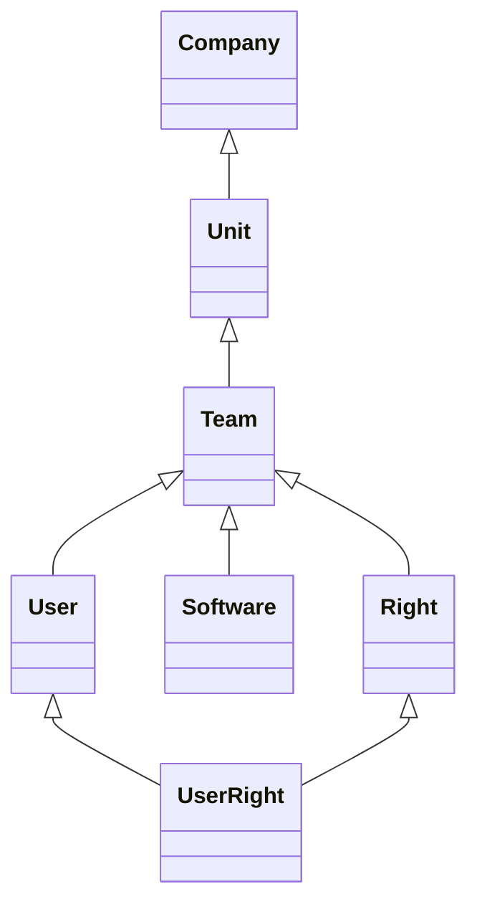

# DUDe - Dummy User Directory

---

## Presentation

The DUDe is an attempt of creating an easy and very simplistic user access management tool.  
It's so simplistic that in fact, it **should not be used** in production. Like never.

I created it to fill a need but also as an intellectual challenge (whatever it means 😀).

## Architecture

The micro-service runs on Flask/Gunicorn and is powered by a SQLite database.  
The whole "stuff" is revolving around these seven tables:

> **Company**  
> This is the main entity where all other entities are regrouped.  
> For example, *ACME Corp* is a good name for a company.

> **Unit**  
> This is a logical unit within the company. A company as one or more units.  
> For example, *HR*, *Marketing* or *IT* are units.

> **Team**  
> A unit is composed of several teams working together towards a same goal.  
> For example, in the *Marketing* unit, we can have *Press* and *Social Media* as teams.

> **User**  
> A user belongs to a team and perform duties / operations on its behalf.  
> John and Sarah are part of the 'Social Media' team.

> **Right**  
> On behalf of their team, user can perform some actions with an application which is also 
> depending on their right to do so.  
> For example, *read*, *write* or *publish* might be some doable actions for 'Social Media' team members.

> **Software**  
> A software is the application that will interogate the micro-service to retrieve the authorized 
> action that a user can perform.  
> For example, 'Social Media' team as a software called 'StoryBuilder' that allows its user to 
> read, write or publish stories on Instagram.

> **UserRight**  
> This is the table that is queried by the micro-service and that associates a user with its rights.  
> For example, John can read or write stories, but only Sarah is entitled to publish them.

---

## License

his program is under the **Apache License 2.0**.  
A copy of the license is available [here](https://choosealicense.com/licenses/apache-2.0/).
