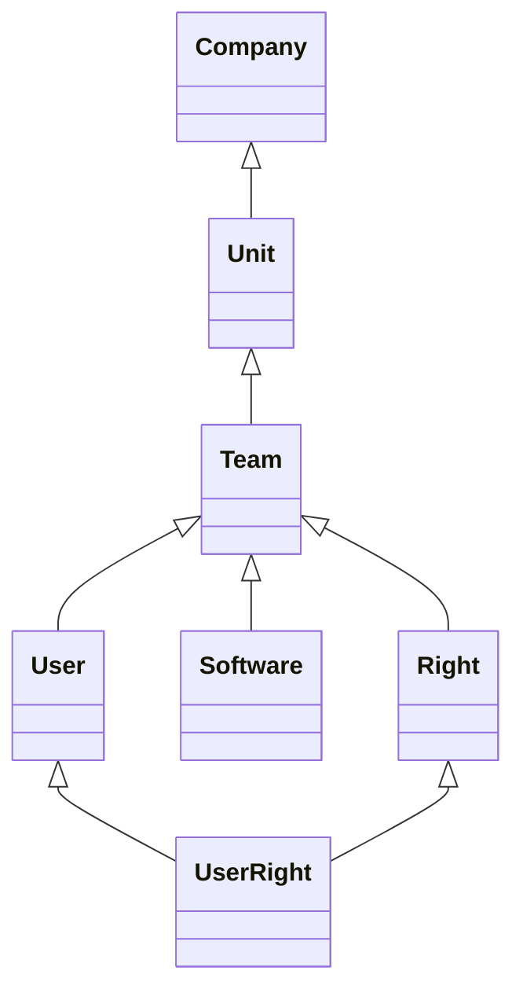

# DUDe - Dummy User Directory


---

## Presentation

The DUDe is an attempt of creating an easy and very simplistic user access management tool.  
It's so simplistic that in fact, it **should not be used** in production. Like never.

I created it to fill a need but also as an intellectual challenge (whatever it means 😀).

## Architecture

The micro-service runs on Flask/Gunicorn and is powered by a SQLite database.  
The whole "stuff" is revolving around these seven tables:



> **Company**  
> This is the main entity where all other entities are regrouped.  
> For example, *ACME Corp* is a good name for a company.

> **Unit**  
> This is a logical unit within the company. A company as one or more units.  
> For example, *HR*, *Marketing* or *IT* are units.

> **Team**  
> A unit is composed of several teams working together towards a same goal.  
> For example, in the *Marketing* unit, we can have *Press* and *Social Media* as teams.

> **User**  
> A user belongs to a team and perform duties / operations on its behalf.  
> John and Sarah are part of the 'Social Media' team.

> **Right**  
> On behalf of their team, user can perform some actions with an application which is also 
> depending on their right to do so.  
> For example, *read*, *write* or *publish* might be some doable actions for 'Social Media' team members.

> **Software**  
> A software is the application that will interogate the micro-service to retrieve the authorized 
> action that a user can perform.  
> For example, 'Social Media' team as a software called 'StoryBuilder' that allows its user to 
> read, write or publish stories on Instagram.

> **UserRight**  
> This is the table that is queried by the micro-service and that associates a user with its rights.  
> For example, John can read or write stories, but only Sarah is entitled to publish them.


## A (tiny) bit of security

We are in 2022, and unless you were living under a rock for the past 20 years, we will secure the communication with SSL.  
A Makefile is present in the *certs* directory to help you create a root certificate and a server certificate.  
And yes, it's a self signed certificate, which is bad, but it's sufficient for testing.

1. Create the root certificate

``` bash
$ cd certs
$ make server_cert
```

2. Create the server certificate

By default the server certificate will be named '**my_dev_site.cert.pem**'.  
You can override this value by setting the environment variable *SERVER_NAME* before calling make.

``` bash
# use the standard name 
$ make server_cert

# use a different name
$ make SERVER_NAME=let_me_in server_cert
```

After some time, you should have a directory with several files in it:

```
.
├── Makefile                        # that's our boy
├── my_dev_site.cert.pem            # server certificate
├── my_dev_site.key.pem             # server key
└── root
    ├── root_ca.cert.pem            # root certificate
    ├── root_ca.cert.srl            # <- you can trash this one
    └── root_ca.key.pem             # root key
```

⛔️ Don't forget that you must **NEVER** disclose your root key and certificate to anyone.

In case you want a good primer on OpenSSL Certificate Authority, you can have a look [here](https://jamielinux.com/docs/openssl-certificate-authority/).


>❗️ **IMPORTANT**  
If you change the name of the certificate, you will have to update the gunicorn configuration in 'server/gunicorn.con.py'.  
This is not ideal and I should probably use an environment variable for that.

## Starting the server

1. First thing first, you need to install the Python dependencies for this project.  

``` bash
$ pip install -r requirements.txt
```

2. Define environment variable DUDE_SECRET_KEY

This variable is used by the server to protect administrative endpoints.  
The value should be present in the HTTP header (X-API-Token) otherwise the action is refused.  
A good way to create one, is to use *OpenSSL*:

``` bash
# generate a 20 char. hexadecimal string
$ export DUDE_SECRET_KEY=$(openssl rand -hex 20)
```

Then you can run the server:

``` bash
$ cd server
$ gunicorn
```
If the SSL certificates are available, they will be automatically loaded by gunicorn.

## Testing the server

You can test the server by using the '/version' endpoint and curl.

``` bash
$ curl --cacert certs/root/root_ca.cert.pem https://localhost:5000/version
{
  "version": "1.0.0"
}
```

If you receive the version, that means the connection is working.

## API Endpoints

The endpoints are described in a OpenAPI 3.0 document available [here](./docs/dude.openapi.yml).  
You can import this file into [Postman](https://www.postman.com/) and it can create automatically a collection from it.

### Validating rights

1. Retrieve an authentication token

To validate a user's right, you first need to retrieve an authentication token.  
To do so, you query the **/auth** endpoint with the name and the api-key of the software that performs the check.  
If both parameters are valid, the API will answer with a token.

2. Validating user's right

With the token, you can now validate the user's right by querying the **/validate** endpoint.

## Libraries

To integrate the DUDe to your application, there is a library in Python ([py-DUDe](https://github.com/oaxley/py-DUDe)).  
I'm planning to do the same in Rust soon (rs-DUDe) when I will have some time.


---

## License

his program is under the **Apache License 2.0**.  
A copy of the license is available [here](https://choosealicense.com/licenses/apache-2.0/).
